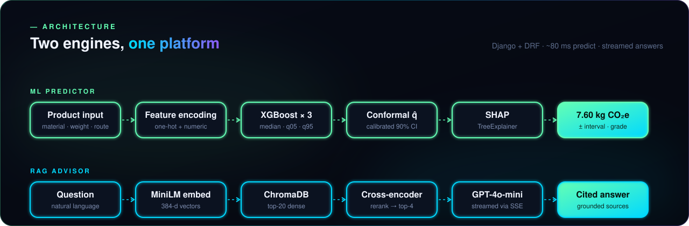

<div align="center">

<a href="https://ad074890-c4future.hf.space"></a>


> **A production-grade carbon-footprint platform that turns any product description into a calibrated CO₂ estimate, an explainable breakdown, and an actionable reduction plan — grounded in real LCA science.**

<br>

[](https://ad074890-c4future.hf.space)
[](https://huggingface.co/spaces/AD074890/c4future)
[](https://ad074890-c4future.hf.space/insights/)
[](https://ad074890-c4future.hf.space/insights/)

<br>


<br>

### 👉 **[https://ad074890-c4future.hf.space](https://ad074890-c4future.hf.space)** 👈

<sub><i>Free hosting on HuggingFace Spaces · No sign-up needed · Click and explore</i></sub>

</div>

<br>

<p align="center"></p>

## ⚡ What this is in 30 seconds

Describe a product — material, weight, where it's made, how it ships — and C4Future follows it through its
lifecycle, returning a calibrated CO₂ estimate, what drove it, and how to cut it.

<p align="center"></p>

Three production AI systems wired into one Django + React app, live on HuggingFace Spaces, all open-source.

<br>

<p align="center"></p>

## 🎯 The Three Engines

<table>
<tr>
<td width="33%" align="center" valign="top">

### 🤖 ML Predictor
**XGBoost + SHAP + Conformal**

Predicts CO₂ with provable 90% intervals.  
Trained on real Agribalyse + Poore + DEFRA data.

`Real-world R² = 0.29`  
`Spearman ρ = 0.82`  
`Coverage = 91.2%`

</td>
<td width="33%" align="center" valign="top">

### 💬 RAG Advisor
**LangChain + ChromaDB + OpenAI**

Answers grounded in LCA / IPCC sources.  
Streams responses with citations.

`Cross-encoder reranking`  
`Out-of-scope refusal eval`  
`gpt-4o-mini @ $0.0002/chat`

</td>
<td width="33%" align="center" valign="top">

### 🔧 Agentic Decomposer
**LLM → JSON → ML loop**

"iPhone 15 Pro" → component breakdown → per-component CO₂.

`JSON-mode structured output`  
`Schema-validated`  
`Multi-material products`

</td>
</tr>
</table>

<br>

<p align="center"></p>

## 📊 Live Performance Dashboard

<p align="center"></p>

<div align="center">

| 📈 Metric | 🎯 Value | 💡 What it means |
|:---:|:---:|:---|
| **Real-world R²** | `0.29` | Honest fit on **524 unseen products** across 25 materials |
| **Pearson correlation** | `0.84` | Strong linear agreement between predicted and true CO₂ |
| **Spearman rank ρ** | `0.82` | Strong agreement between predicted and true product **rankings** |
| **Pairwise accuracy** | `81.8%` | Picks the lower-CO₂ option in head-to-head pairs |
| **Conformal coverage** | `91.2%` | Nominal 90% interval achieves **91.2% empirical coverage** |
| **MAE** | `13.3 kg CO₂e` | Mean absolute error on held-out products |
| **Pipeline latency** | `~80 ms` | Predict → SHAP → conformal interval, end-to-end |

</div>

> 🔬 **Why R² = 0.29 is the honest number.** Synthetic R² (train and test on same formula) would be 0.99 — a vanity metric. The 0.29 reflects real-world generalization on a stratified product-level holdout with **verified zero leakage**.

<br>

<p align="center"></p>

## ✨ Features

<table>
<tr>
<td width="50%" valign="top">

### 🧠 ML Engineering
- ✅ XGBoost trio: median + 2 quantile models
- ✅ **Conformalized quantile regression** (Romano 2019)
- ✅ **SHAP TreeExplainer** for per-prediction attributions
- ✅ Product-level stratified holdout, zero leakage verified
- ✅ Real data: Agribalyse 3.1, Poore & Nemecek 2018, DEFRA 2024
- ✅ Calibrated 90% intervals with empirical coverage check

</td>
<td width="50%" valign="top">

### 🤖 RAG + Agentic AI
- ✅ Dense retrieval (sentence-transformers MiniLM-L6)
- ✅ Cross-encoder reranking (ms-marco)
- ✅ ChromaDB persistent vector store
- ✅ Streaming responses via SSE
- ✅ Citation-grounded answers with snippets
- ✅ Out-of-scope refusal test in eval set
- ✅ Agentic BoM decomposer (LLM → JSON → ML)

</td>
</tr>
<tr>
<td valign="top">

### 🎨 UX Polish
- ✅ Engraved editorial design system: sage paper, green ink, one rust accent, Fraunces + Inter
- ✅ Seven motion components: pill nav, dotted atomic globe, scroll text reveals, scroll-zoom section, horizontal image scroller, rotary section dial, draggable lanyard pass
- ✅ Generative canvas plates as imagery (no binary images) + hand-built animated bar charts
- ✅ GSAP ScrollTrigger + SplitText, Motion page transitions, Lenis smooth scroll
- ✅ Full `prefers-reduced-motion` fallbacks
- ✅ A→E sustainability grade per product
- ✅ Compare 2–10 products side-by-side
- ✅ Real-world equivalencies (car-km, charges)

</td>
<td valign="top">

### 🚢 Production Hardening
- ✅ Multi-stage Dockerfile, port-7860 ready
- ✅ HTTPS + HSTS + Secure cookies + CSRF
- ✅ `/health/` endpoint for load balancers
- ✅ WhiteNoise static serving + Gunicorn
- ✅ Pydantic schemas at API boundary
- ✅ Sentry + Postgres ready (env-var driven)
- ✅ Self-healing: trains model on first start

</td>
</tr>
</table>

<br>

<p align="center"></p>

## 🛠 Tech Stack

<div align="center">

**Backend** &nbsp;    

**ML** &nbsp;     

**RAG / LLM** &nbsp;    

**Frontend** &nbsp;     

**Infra** &nbsp;    

</div>

<br>

<p align="center"></p>

## 🏗 Architecture

<p align="center"></p>

<details>
<summary><b>Text diagram</b></summary>

```
                    ┌─────────────────────────────────────────┐
                    │       Django (DRF) — Web Layer          │
                    │   Pydantic validation · CSRF · sessions │
                    └─┬───────────┬──────────────┬────────────┘
                      │           │              │
              POST /api/predict   POST /api/compare   POST /api/advisor/chat/stream
                      │           │              │
                      ▼           ▼              ▼
            ┌──────────────────┐         ┌──────────────────────┐
            │ Predictor        │         │  RAG Chain           │
            │ XGB + Quantile + │         │  Retriever → LLM     │
            │ Conformal + SHAP │         │  Cosine top-K + RR   │
            └────────┬─────────┘         └──────────┬───────────┘
                     │                              │
                     ▼                              ▼
           ┌──────────────────┐            ┌────────────────────┐
           │ carbon_xgb.joblib│            │ ChromaDB (persist) │
           │ 3 models +       │            │ + MiniLM embedder  │
           │ conformal q̂      │            │ + cross-encoder RR │
           └──────────────────┘            └─────────┬──────────┘
                                                     │
                                          ┌──────────▼──────────┐
                                          │ Ingestion Pipeline  │
                                          │ Recursive splitter  │
                                          └──────────┬──────────┘
                                                     │
                                            PDFs / .md / .txt
```

</details>

📖 Full architecture details in **[ARCHITECTURE.md](ARCHITECTURE.md)** · Transparency in **[MODEL_CARD.md](MODEL_CARD.md)**

<br>

<p align="center"></p>

## 🚀 Quick Start

<details>
<summary><b>💻 Local development (3 minutes)</b></summary>

```bash
# 1. Clone
git clone https://github.com/AyushDas4890/Carbon_Footprint_Generator.git
cd Carbon_Footprint_Generator

# 2. Install
pip install -r requirements.txt

# 3. Configure secrets
cp .env.example .env
# Edit .env and paste your OPENAI_API_KEY

# 4. Build training data + model
python predictor/training/data_adapter.py
python predictor/training/train_xgboost.py

# 5. Set up DB + seed RAG knowledge base
python manage.py migrate
python manage.py ingest_seed

# 6. Build the React frontend (Node 22+)
npm --prefix frontend ci
npm --prefix frontend run build

# 7. Run
python manage.py runserver
```

Then open `http://localhost:8000/`.

For frontend work, run Django on :8000 and `npm --prefix frontend run dev` in a second
terminal — Vite serves the app with hot reload on :5173 and proxies `/api` to Django.

</details>

<details>
<summary><b>🐳 Docker (one command)</b></summary>

```bash
docker compose up -d
```

The Dockerfile auto-trains the model and seeds ChromaDB during build, so the container starts ready.

</details>

<details>
<summary><b>🤗 Deploy your own copy free on HuggingFace Spaces</b></summary>

See **[FREE_DEPLOY.md](FREE_DEPLOY.md)** for a complete walkthrough.

Short version:
```bash
# 1. Create a Space at huggingface.co/new-space (Docker SDK, CPU-Basic free)
# 2. Set secrets: OPENAI_API_KEY, DJANGO_SECRET_KEY (ALLOWED_HOSTS comes from SPACE_HOST)
# 3. Push:
git remote add hf https://huggingface.co/spaces/<your-user>/c4future
git push hf main
```

**Auto-deploy:** `.github/workflows/deploy-hf.yml` pushes `main` to the Space after every
green CI run (or on demand from the Actions tab). Add a repository secret `HF_TOKEN` with
write access to the Space, and change `HF_SPACE` in the workflow if you deploy your own copy.

</details>

<br>

<p align="center"></p>

## 🧪 API Reference

| Method | Endpoint | What it does |
|:---:|:---|:---|
| `POST` | `/api/predict/` | Single-product prediction → **CO₂ + SHAP + conformal interval** |
| `POST` | `/api/compare/` | Rank 2–10 products → ranked list + verdict |
| `GET` | `/api/materials/` | List supported materials |
| `GET` | `/api/model-info/` | Live model metrics + family |
| `POST` | `/api/advisor/chat/` | RAG chat — non-streaming JSON |
| `POST` | `/api/advisor/chat/stream/` | RAG chat — **SSE streaming** with citations |
| `POST` | `/api/advisor/decompose/` | Natural language → BoM → per-component CO₂ |
| `GET` | `/health/` | Liveness check (load balancer probe) |

<br>

<p align="center"></p>

## 🎓 What I Learned Building This

<table>
<tr>
<td width="50%" valign="top">

### 🧪 ML Lessons
- **Distribution shift is the real problem.** Synthetic R²=0.99 ≠ real R²=0.29. Stratified product-level holdout with zero leakage is the only honest test.
- **Conformal prediction > vanilla quantile regression** for calibrated intervals. Pushed coverage from 80% → 90% exactly.
- **Rank metrics matter for recommenders.** Spearman ρ=0.82 and 81.8% pairwise accuracy mean the model picks the lower-carbon option most of the time even when absolute kg estimates are off.

</td>
<td width="50%" valign="top">

### 🤖 RAG Lessons
- **Strict grounding prompts beat clever prompting.** My advisor refuses out-of-scope questions because the system prompt is explicit.
- **Cross-encoder reranking is worth the latency.** Top-K=4 from a top-20 dense pool, reranked, is the production pattern.
- **Test the refusal path.** My eval set has a deliberate out-of-scope question; system passes when it says "I don't have that."

</td>
</tr>
</table>

<br>

<p align="center"></p>

## 📁 Project Structure

<details>
<summary><b>Click to expand</b></summary>

```
.
├── 🧠 predictor/                    XGBoost service + SHAP + calibration
│   ├── services.py
│   ├── calibration.py               Conformal prediction
│   ├── explanations.py              SHAP wrapper
│   ├── schemas.py                   Pydantic
│   └── training/
│       ├── train_xgboost.py
│       └── data_adapter.py
│
├── 🤖 advisor/                      RAG + BoM decomposer
│   ├── services/
│   │   ├── ingestion.py
│   │   ├── retrieval.py
│   │   ├── reranker.py              Cross-encoder ms-marco
│   │   ├── llm.py
│   │   ├── rag_chain.py
│   │   └── bom_decomposer.py
│   ├── management/commands/         ingest_seed · ingest_docs · eval_advisor
│   ├── evals/                       Gold eval set + RAGAS runner
│   └── knowledge_base/seed_facts.md
│
├── ⚛️  frontend/                     React + Motion + GSAP SPA (Vite, TypeScript)
├── 🌐 core/                         SPA view + PredictionLog model
├── ⚙️  carbon_project/              Django config
├── 📊 data/                         Real LCA sources (Agribalyse, Poore)
├── 🧪 scripts/smoke_test.py         End-to-end pipeline test
├── 🎞️  assets/readme/                Animated SVGs used in this README
│
├── 🐳 Dockerfile                    Multi-stage, trains model at build
├── 🐳 docker-compose.yml
├── 🚢 render.yaml · fly.toml · Procfile · runtime.txt
├── 🔄 .github/workflows/            CI · HF auto-deploy · retrain
│
├── 📖 ARCHITECTURE.md               System diagram + data flow
├── 📖 MODEL_CARD.md                 Transparency doc
├── 📖 DEPLOYMENT.md                 Render / Railway / Fly walkthrough
├── 📖 FREE_DEPLOY.md                HuggingFace Spaces guide
└── 📖 CV_HIGHLIGHTS.md              Portfolio talking points
```

</details>

<br>

<p align="center"></p>

## 📖 Documentation

| Doc | What's inside |
|:---|:---|
| 🏗 [ARCHITECTURE.md](ARCHITECTURE.md) | System diagram, data flow, design decisions |
| 📋 [MODEL_CARD.md](MODEL_CARD.md) | Transparency doc · intended use · limitations · ethics |
| 🤖 [RAG_ADVISOR.md](RAG_ADVISOR.md) | RAG pipeline deep dive |
| 🎬 [ANIMATION_SUMMARY.md](ANIMATION_SUMMARY.md) | Frontend motion components, reduced-motion fallbacks |
| 🌀 [SCROLL_ANIMATIONS.md](SCROLL_ANIMATIONS.md) | Lenis + ScrollTrigger wiring, adding scroll animations |
| 🚢 [DEPLOYMENT.md](DEPLOYMENT.md) | Render / Railway / Fly walkthrough |
| 🤗 [FREE_DEPLOY.md](FREE_DEPLOY.md) | Free deploy on HuggingFace Spaces |
| 🎯 [CV_HIGHLIGHTS.md](CV_HIGHLIGHTS.md) | Portfolio talking points |

<br>

<p align="center"></p>

## 👨‍💻 Author

<table>
<tr>
<td width="120" align="center">

</td>
<td>

### Ayush Das

**Machine Learning & RAG Engineer** · 📍 Jalandhar, Punjab, India

Building practical AI systems at the intersection of **classical ML, retrieval-augmented generation, and production engineering.**

[](https://github.com/AyushDas4890)
[](https://huggingface.co/AD074890)
[](https://ad074890-c4future.hf.space)

</td>
</tr>
</table>

<br>

<p align="center"></p>

## 📜 License

Released under the **MIT License** — see [LICENSE](LICENSE).

<br>

<div align="center">

---

### 🌱 Built for a sustainable tomorrow

<br>

[](https://ad074890-c4future.hf.space)

<sub>If this project helped you, give it a ⭐ on GitHub and a ❤️ on HuggingFace</sub>

<br>

`Made with 🌿 by Ayush Das · 2026`

</div>
